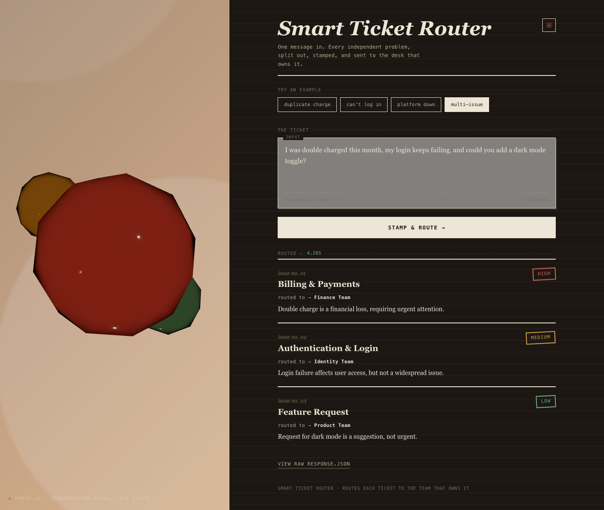

# Smart Ticket Router

Paste a free-text support ticket. Get back a structured routing decision — category,
priority, assigned team, and a one-line reason — for every independent problem the ticket
contains. No manual triage, no ambiguity about who owns what.

A ticket that says *"I was double charged this month, my login keeps failing, and could you
add a dark mode toggle?"* doesn't become one vague ticket in one team's queue. It becomes
three: Finance (High), Identity (Medium), Product (Low) — each with its own reasoning.




## How it works

```
Frontend (Next.js)  --POST /route-->  Backend (FastAPI)  --raw JSON-->  OpenAI (gpt-4o-mini)
Frontend (Next.js)  <--{issues:[…]}--  Backend (FastAPI)  <--raw JSON--  OpenAI (gpt-4o-mini)
```

Inside the backend, before and after that OpenAI call:
1. Redact PII (regex, before the LLM ever sees the text)
2. Summarize if the ticket is over ~300 words (one extra LLM call)
3. Validate the LLM's output against a closed Pydantic schema
4. Repair once on invalid JSON, otherwise fall back to a Human-Triage issue
5. Assign each issue's `id` and `assigned_team` — backend-owned, never the LLM's job

The LLM's only job is understanding language: split the ticket into independent issues,
classify each into one of 9 fixed categories, judge priority by business impact, write a
one-line reason. Everything deterministic — issue IDs, team assignment, PII redaction,
retry/fallback logic, response shape — is backend code, not a prompt. The API contract never
changes shape and **never returns a 5xx**: an internal failure still comes back as a normal
`200` with a Human-Triage fallback issue, so the frontend never has to special-case a broken
backend call versus an unreachable one.

## Try it live

Not deployed yet. See [Deployment](#deployment) below — once live, the URLs go here.

## Run it locally

```bash
git clone https://github.com/VinitP31/smart-ticket-router.git
cd smart-ticket-router
```

**Backend** (needs an [OpenAI API key](https://platform.openai.com)):
```bash
cd backend
python3 -m venv .venv && source .venv/bin/activate
pip install -r requirements.txt
cp .env.example .env        # fill in OPENAI_API_KEY
uvicorn main:app --reload   # http://127.0.0.1:8000
```

**Frontend** (in a second terminal):
```bash
cd frontend
npm install
cp .env.local.example .env.local   # NEXT_PUBLIC_API_URL=http://localhost:8000
npm run dev                        # http://localhost:3000
```

Full setup, troubleshooting, and CLI usage: [`backend/README.md`](backend/README.md) ·
[`frontend/README.md`](frontend/README.md).

## What's actually interesting here

- **Multi-issue detection.** One ticket, N independent problems, N separately-routed issues
  — never merged into one wrong bucket, never over-split (a crash *with* its error code is
  one issue, not two).
- **Priority is business impact, not tone.** An angry message about a typo is still Low; a
  calm message about a double charge is still High. The same category can land at any
  priority — priority and category are independent judgments.
- **PII never reaches the LLM.** Email, phone, card, PAN, Aadhaar, and account numbers are
  regex-redacted to placeholders *before* the first API call, every time.
- **Long tickets get summarized, never truncated.** Past ~300 words, one extra LLM call
  condenses the ticket — preserving every distinct problem and urgency signal — before
  routing runs on the summary.
- **A closed contract the LLM can't break.** Category and priority are Pydantic enums; an
  invented category fails validation, triggers one repair attempt, then falls back to a
  Human-Triage issue rather than ever surfacing malformed data or an error page.
- **Every state is designed, not just the happy path.** Empty/loading/results/error are all
  deliberate UI states — including a simulated staged-progress indicator instead of real
  token-streaming, because the response is structured JSON that must be fully validated
  before it's safe to render (streaming partial JSON would risk showing garbage mid-parse).

## Stack

| | |
|---|---|
| Backend | Python 3.11+, FastAPI, Pydantic v2, OpenAI SDK (`gpt-4o-mini`) |
| Frontend | Next.js 16 (App Router), TypeScript, Tailwind CSS v4 |
| Hosting (planned) | Render (backend) · Vercel (frontend) |

## Repository layout

```
smart-ticket-router/
├── backend/    FastAPI service — see backend/README.md
├── frontend/   Next.js UI — see frontend/README.md
└── docs/
    └── Master_doc.md   full architecture/design reference + decision log
```

## API contract

```
POST /route
  body: { "ticket": "<text>" }
  200:  { "issues": [{id, category, priority, assigned_team, reasoning}], "processing_time_ms": int }

GET /health
  200: { "status": "ok" }
```

9 fixed categories (Authentication & Login, Billing & Payments, Technical Bug, Performance &
Availability, Feature Request, Account Management, Security & Access, Orders & Operations,
General/Uncategorized), each mapped to one team.

## Testing

```bash
cd backend && pytest tests/test_router.py -v      # 27 sample tickets through the real pipeline
./backend/scripts/test_failure_modes.sh           # bad/missing API key, bad model — never a 5xx
```

## Deployment

Two hosts, one repo — each platform points at its own subfolder as the project root.

- **Backend → Render:** build `pip install -r requirements.txt`, start
  `uvicorn main:app --host 0.0.0.0 --port $PORT`. Env: `OPENAI_API_KEY`, `LLM_MODEL`,
  `ALLOWED_ORIGINS`.
- **Frontend → Vercel:** auto-detected Next.js build. Env: `NEXT_PUBLIC_API_URL` pointed at
  the Render URL.
- Deploy the backend first, then the frontend, then go back and add the frontend's Vercel
  URL to the backend's `ALLOWED_ORIGINS` and redeploy — CORS needs the frontend URL to
  already exist.

Details: [`backend/README.md`](backend/README.md#deploy-render) ·
[`frontend/README.md`](frontend/README.md#deploy-vercel).

## Known limitations

Accepted MVP scope, not oversights: the `/route` endpoint has no auth or rate-limiting
(anyone with the URL can call it), PII redaction is regex-only (a bare 12-digit number is
indistinguishable from an Aadhaar number), and there's no persistence layer — every request
is stateless, nothing is stored.
