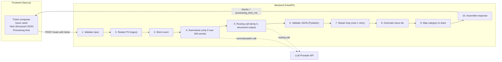
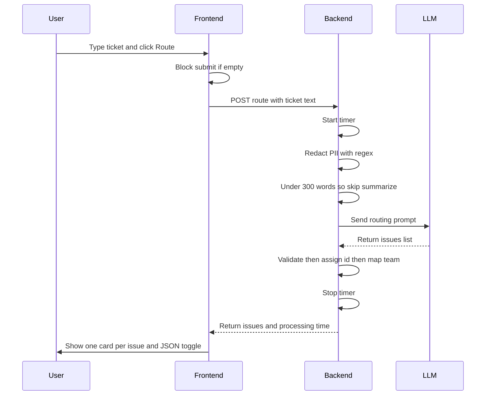
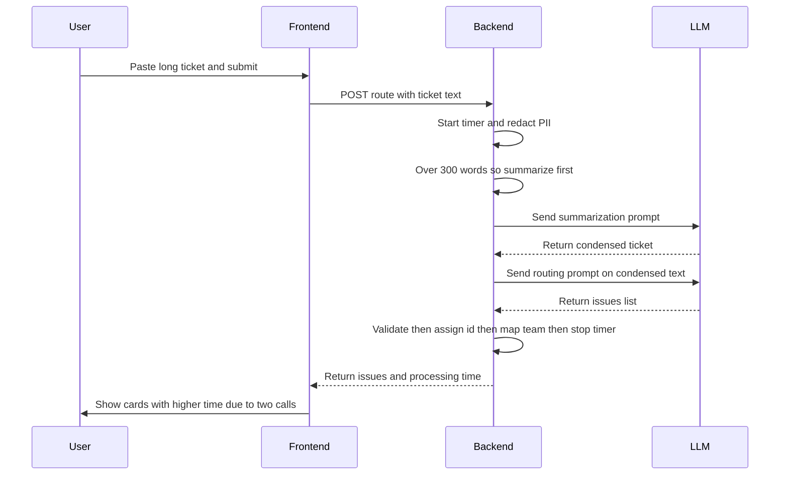
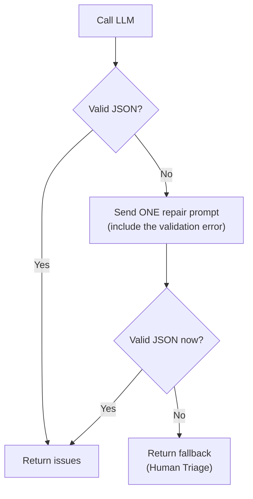

# Smart Ticket Router — Master Engineering Document
### Port·04 · "The Senate of Gods" · Calfus Gen AI Mission
**Status:** Confirmed design · MVP build spec · Source of truth
**Owner:** Vinit (Gen AI Intern) · **Reviewer:** Mentor
**Document version:** 1.0

---

> **What this document is.** The single source of truth for the Smart Ticket Router. Every architectural, product, UI/UX, backend, LLM, and security decision that has been confirmed lives here, plus the deployment question and why it was declined. Use it while coding, while learning, when you hit an error, when preparing your demo or slides, and when walking a mentor or senior through the system.
>
> **How to read it.** Parts 1–6 are the mental model (read first, and before any demo). Parts 7–16 are the confirmed design & contracts (the rules the code must obey). Parts 17–19 are backend/frontend/security build specs. Parts 20–23 cover tech stack, GitHub, and the (declined) deployment question. Parts 24–33 are testing, trade-offs, rubric prep, and demo material. The appendices hold a decision log and a ready-to-use `CLAUDE.md`.
>
> **Golden rules that must never be broken (memorize these five):**
> 1. The API always returns the **same shape** — `{ "issues": [ ... ] }`. Only the array length changes.
> 2. The **LLM classifies; the backend decides everything deterministic** (issue `id`, `assigned_team`, timing, validation).
> 3. **Category is a closed set of 9.** The model never invents a category.
> 4. **Priority is business impact, not tone and not category.** The same category can be High or Low by context.
> 5. **PII is redacted before the ticket ever reaches the LLM.**

---

## Table of Contents

**Part I — Mental model**
1. Executive summary
2. The mission & business problem
3. High-level overview (simple diagram)
4. System architecture (detailed diagram)
5. End-to-end request flow (sequence diagrams)
6. Responsibility split — LLM vs Backend

**Part II — Confirmed design & contracts**
7. Category taxonomy (the 9 categories → teams)
8. Priority model
9. The API response contract
10. Multi-issue handling
11. Long-ticket handling (summarize, don't truncate/chunk)
12. PII redaction
13. Prompt engineering (system prompt + few-shot)
14. Schema & validation (Pydantic + repair loop)
15. Reliability & error handling
16. Performance measurement (timing)

**Part III — Build specs**
17. Backend design (structure, endpoints, CLI)
18. Frontend design (UI/UX, issue cards, JSON toggle)
19. Security, secrets & authentication

**Part IV — Ship it**
20. Tech stack summary
21. Repository strategy (two repos)
22. Version control & GitHub (step by step)
23. Deployment (not applicable — runs locally only)

**Part V — Prove it**
24. Testing strategy
25. Before/after time comparison
26. Trade-offs & design decisions (+ ADR-001…008)
27. Limitations & "what I'd do differently"
28. Future enhancements (roadmap)
29. Evaluation rubric decoder
30. Mentor Q&A cheat sheet
31. Demo script
32. Presentation / slide outline
33. Glossary

**Appendices**
- A. Decision log / revision history
- B. Starter `CLAUDE.md`

---

# Part I — Mental model

## 1. Executive summary

The Smart Ticket Router reads a free-text customer support message and returns a structured routing decision for **every independent issue** the message contains: its `category`, `priority`, the `assigned_team`, and a one-line `reasoning`, plus a backend-generated `id`. Support teams stop triaging tickets by hand; the machine pre-sorts the queue and shows a human-readable justification per issue.

The system is deliberately split: a **Python/FastAPI backend** owns all deterministic logic (PII redaction, length check, summarization trigger, LLM call, JSON validation, id generation, category→team mapping, timing) and a **large language model** owns only reasoning and classification. A **React/Next.js frontend** presents each issue as a polished card, with a collapsible panel showing the exact structured JSON. Total processing time is measured end-to-end and surfaced to the user.

Scope discipline: this is an MVP that must work **end to end with no malfunctions**. Everything not required is parked in the roadmap (Part 28).

## 2. The mission & business problem

**The pain.** Support teams drown in tickets. Today a human reads each ticket, decides what it's about, judges urgency, and forwards it to a team — roughly 30–60 seconds of skilled attention per ticket, inconsistent between people, and it is the bottleneck *before* anyone actually helps the customer. Mis-routing is expensive: a High-priority security ticket sitting in the Billing queue is an SLA breach and possibly a churned customer.

**Who uses it.** A Tier-1 support lead who today spends the first hour of every shift triaging the overnight queue. The router hands them a pre-sorted queue with a one-line justification per issue, so they only step in when the reasoning looks wrong.

**The value.** Consistent, instant, explainable routing; multiple problems in one message handled separately instead of collapsed into one wrong bucket; a measurable speed-up over manual triage (Part 25).

## 3. High-level overview (simple diagram)

The simplest possible picture — read this to a non-technical person:

```
   ┌──────────────┐        ┌───────────────────────────┐        ┌─────────────┐
   │   A support  │  text  │   Smart Ticket Router     │  JSON  │  The right  │
   │   message    │ ─────▶ │   (reads + understands +  │ ─────▶ │  team(s),   │
   │  (free text) │        │    decides + explains)    │        │  sorted by  │
   └──────────────┘        └───────────────────────────┘        │  urgency    │
                                                                 └─────────────┘
```

One message in → one or more clear, explained routing decisions out. That is the whole product.

## 4. System architecture (detailed diagram)

Three moving parts: the **frontend** (what the user sees), the **backend** (the brain and all the rules), and the **LLM provider** (the reasoning engine the backend calls).



Key property: the LLM is called from *inside* the backend and never touches the frontend directly. The API key lives only on the backend. The frontend only ever talks to your backend.

## 5. End-to-end request flow (sequence diagrams)

**Short ticket (the common case — one LLM call):**



**Long ticket (> ~300 words — two LLM calls):**



> If you view this document on GitHub, the `mermaid` blocks render as real diagrams. In a plain editor they show as code — that's fine, the labels are readable.

## 6. Responsibility split — LLM vs Backend

This split is the backbone of the whole design and the single best thing to explain in your demo. **The LLM reasons; the backend owns anything that must be deterministic and reliable.**

| Concern | Owner | Why |
|---|---|---|
| Detect independent issues | **LLM** | Requires language understanding |
| Classify each issue into a category | **LLM** | Reasoning task |
| Decide priority (business impact) | **LLM** | Contextual judgement |
| Write one-line reasoning | **LLM** | Natural language |
| PII redaction | **Backend** | Deterministic, must happen before LLM |
| Word count & summarization trigger | **Backend** | Deterministic rule |
| JSON validation | **Backend** | Contract enforcement |
| Issue `id` generation | **Backend** | Must be unique & reliable — never trust the model |
| Category → team mapping | **Backend** | Fixed business rule, not an AI guess |
| Timing / performance measurement | **Backend** | Deterministic |
| Final response assembly | **Backend** | Owns the contract |

---

# Part II — Confirmed design & contracts

## 7. Category taxonomy (the 9 categories → teams)

These are the **only** allowed categories. The model must pick exactly one per issue and must never invent a new one.

| # | Category (user-facing) | Assigned Team (internal, set by backend) | Typical examples |
|---|---|---|---|
| 1 | Authentication & Login | Identity Team | Login failure, MFA, password reset |
| 2 | Billing & Payments | Finance Team | Refunds, invoices, failed/duplicate payments |
| 3 | Technical Bug | Engineering Team | Crashes, errors, broken functionality |
| 4 | Performance & Availability | Platform Team | Slow app, downtime, latency, outages |
| 5 | Feature Request | Product Team | New features, enhancements, suggestions |
| 6 | Account Management | Customer Success Team | Profile updates, plan changes, settings |
| 7 | Security & Access | Security Team | Suspicious login, permission issues, breaches |
| 8 | Orders & Operations | Operations Team | Shipping, delivery, order status |
| 9 | General / Uncategorized | Human Triage | Vague, insufficient info, spam, unsupported |

**Design rationale (say this to your mentor):**
- **Category is user-facing; team is internal.** This mirrors real production systems and is exactly why the team is derived in code, not asked of the model.
- **Department-based, SaaS-realistic.** Splitting "technical" into *Technical Bug* (Engineering) vs *Performance & Availability* (Platform) forces the model to reason ("is it broken, or just slow?") and maps to two genuinely different teams.
- **`General / Uncategorized` is the safety valve.** A vague or spam ticket has a legitimate home instead of being forced into a wrong bucket. This is what makes the vague-ticket edge case graceful.

> **Known gap to keep in mind:** there is no dedicated "How-To / Usage Question" category. Pure how-to questions will land in `Account Management` or `General / Uncategorized`. This is an accepted MVP simplification — if the mentor wants how-to as its own category later, it slots in as a 10th entry with a Customer Success mapping.

## 8. Priority model

**Priority is decided by business impact — it is NOT tied to the category, and tone never changes it.** The same category can produce different priorities depending on context.

| Priority | Triggers |
|---|---|
| **High** | Financial loss · incorrect payment · security/privacy risk · system outage · multiple users affected · critical workflow blocked · revenue impact · long-pending critical issue needing escalation |
| **Medium** | One user's important workflow affected · workaround available · moderate business impact |
| **Low** | Questions · feature requests · documentation · suggestions · routine account changes |

**Worked examples (be ready to defend these):**

| Ticket | Category | Priority | Why |
|---|---|---|---|
| "What does this line on my invoice mean?" | Billing & Payments | Low | A question, nothing blocked |
| "I was charged twice / double payment deducted" | Billing & Payments | High | Financial loss |
| "I can't log in" (single user) | Authentication & Login | Medium | One user's workflow, likely a workaround |
| "The login service is down for everyone" | Authentication & Login | High | Outage, many users |

Notice rows 1–2 are the **same category, different priority** — that is the point. Priority is a business-impact judgement the model reasons through against the rubric above; it is *not* a hardcoded `if category then priority` rule.

## 9. The API response contract

**Formal endpoint contract:**

| | |
|---|---|
| **Method & path** | `POST /route` |
| **Request body** | `{ "ticket": "<free-text support message>" }` (JSON) |
| **Success response** | `200 OK` · `{ "issues": [ <issue>, ... ], "processing_time_ms": <int> }` |
| **Issue object** | `{ "id": int, "category": str, "priority": str, "assigned_team": str, "reasoning": str }` |
| **Failure behaviour** | Never a 5xx. On any internal failure the backend still returns `200` with a valid single-issue Human-Triage fallback (see Part 15). |
| **Health check** | `GET /health` → `{ "status": "ok" }` |

**The backend ALWAYS returns the same shape.** Only the number of objects in `issues` changes.

**Single issue:**
```json
{
  "issues": [
    {
      "id": 1,
      "category": "Billing & Payments",
      "priority": "High",
      "assigned_team": "Finance Team",
      "reasoning": "Customer reports a duplicate charge — financial loss."
    }
  ],
  "processing_time_ms": 1180
}
```

**Multiple issues:**
```json
{
  "issues": [
    { "id": 1, "category": "Billing & Payments", "priority": "Medium",
      "assigned_team": "Finance Team", "reasoning": "Reports a duplicate charge." },
    { "id": 2, "category": "Authentication & Login", "priority": "Medium",
      "assigned_team": "Identity Team", "reasoning": "Separately, cannot log in." },
    { "id": 3, "category": "Feature Request", "priority": "Low",
      "assigned_team": "Product Team", "reasoning": "Requests a dark-mode option." }
  ],
  "processing_time_ms": 1440
}
```

**Rules:**
- The `issues` array schema **never changes** — single vs multiple only differs in length.
- Every issue object always contains all five fields: `id`, `category`, `priority`, `assigned_team`, `reasoning`.
- `id` is assigned by the backend (a unique integer per response, e.g. 1..N). The LLM never produces it.
- There is **no `confidence` field** (deferred to the roadmap as "Confidence Score").

> **Open item — processing time placement (confirm with mentor).** The confirmed rule is that the *issues* schema never changes. To carry the timing without touching that schema, this document places `processing_time_ms` as a **top-level sibling field** next to `issues`. The alternative is an HTTP response header (`X-Processing-Time-Ms`). Either keeps the issues array untouched; pick one with your mentor. The frontend converts ms → seconds for display.

## 10. Multi-issue handling

- If a ticket contains multiple **independent** problems, detect each one separately and return one issue object per problem.
- **Never merge** unrelated issues into a single category.
- **Never over-split** a single problem — a crash *with* an error message is **one** issue, not two.

Example: *"I was double charged AND I can't log in — also, can you add dark mode?"* → **three** issues (Billing/Medium, Authentication/Medium, Feature Request/Low). Example: *"The export button crashes and shows a 500 error"* → **one** issue (Technical Bug), because the 500 is part of the same crash.

## 11. Long-ticket handling (summarize, don't truncate/chunk)

**Rule:** if the (redacted) ticket is **≤ ~300 words**, route it directly. If it is **> ~300 words**, run an **LLM summarization pass first** that preserves every distinct problem, request, and urgency signal, then route the summary.

**Why summarization, not the alternatives:**
- **vs truncation:** cutting at N characters can throw away the most important sentence — the real problem is often described at the *end* of a long, rambling message. Truncation silently loses signal.
- **vs chunking:** splitting into chunks and routing each separately fragments *one* problem into partial issues and produces duplicate/contradictory routes, plus messy merging. A single summarization pass gives the router one clean, complete view; multi-issue detection then splits by *real* independent problems, not arbitrary text boundaries.

**Trade-offs & latency:** a long ticket costs **two** LLM calls (summarize → route), so its latency roughly doubles (still a few seconds); short tickets — the common case — are unaffected because the word check is free. Summarization can rarely drop a minor secondary issue; we accept that for the MVP because chunking is worse. The ~300-word threshold is a tunable knob.

## 12. PII redaction

Before the ticket reaches the LLM (or any log), a **regex** pass replaces personal data with neutral placeholders so raw PII never leaves the backend.

| PII type | Placeholder |
|---|---|
| Email address | `[EMAIL]` |
| Phone number | `[PHONE]` |
| Credit/debit card | `[CARD]` |
| Aadhaar (12 digits) | `[AADHAAR]` |
| PAN (India tax ID) | `[PAN]` |
| Bank account number | `[ACCOUNT]` |

Placeholders are harmless for routing — "I was double charged on my card [CARD]" still classifies as Billing perfectly. **Framing for the mentor:** *"Regex is the right level for this MVP — fast, deterministic, no external dependency. An enterprise system would add a dedicated PII-detection service (a cloud DLP API or a trained NER model) to catch names and addresses regex misses, but that's overkill for this scope."*

## 13. Prompt engineering (system prompt + few-shot)

**Approach.** There is **no historical dataset and no seeded data**, so the few-shot examples in the prompt are the only calibration signal. Use **6–8 hand-designed examples** covering every team at least once plus the edge cases (angry tone, vague, ambiguous) and a multi-issue example. Structured output is enforced at the provider level (tool use / JSON mode) *and* validated with Pydantic (Part 14).

**Routing system prompt (starting point → `prompts.py`):**
```
You are a support ticket routing engine. You read one ENGLISH support message and
return ONLY a JSON object. Never add prose, markdown, or code fences.

A single message may contain MORE THAN ONE independent issue. Detect every
independent issue and return one object per issue in an "issues" array. If there is
only one issue, return an array with a single object.

Personal data may already be masked as [EMAIL], [PHONE], [CARD], [AADHAAR], [PAN],
[ACCOUNT]. Treat placeholders as normal text.

CATEGORIES (choose exactly one per issue):
1. Authentication & Login
2. Billing & Payments
3. Technical Bug
4. Performance & Availability
5. Feature Request
6. Account Management
7. Security & Access
8. Orders & Operations
9. General / Uncategorized   (fallback: vague, insufficient info, spam, unsupported)

PRIORITY (choose exactly one per issue) — by BUSINESS IMPACT, not tone, not category:
- High: financial loss, incorrect payment, security/privacy risk, outage, many users
  affected, critical workflow blocked, revenue impact, long-pending critical issue.
- Medium: one user's important workflow affected, workaround available, moderate impact.
- Low: questions, feature requests, documentation, suggestions, routine account changes.

RULES:
- Emotional tone (anger, capitals, exclamation marks) does NOT change priority.
- Split only genuinely INDEPENDENT problems. Do not split one problem into pieces
  (a crash with an error message is one issue).
- If the message is too vague or unclassifiable, use "General / Uncategorized".
- If an issue fits two categories, pick the PRIMARY intent and explain it in reasoning.
- reasoning must be ONE line, <= 160 chars, stating the single deciding factor.

Return JSON: { "issues": [ { "category": ..., "priority": ..., "reasoning": ... }, ... ] }
Do NOT include id or assigned_team; the backend adds them.
```

**Summarization prompt (long tickets only):**
```
Condense this support message for a routing system. Preserve EVERY distinct problem,
request, and any urgency or impact signal (who is affected, whether work is blocked).
Do not solve anything, do not add information. Output plain text, <= ~120 words.
```

**Few-shot set (aim for 6–8, spanning all teams + edge cases):**
1. Billing duplicate charge → Billing & Payments / High.
2. Suspicious login alert → Security & Access / High.
3. "Whole platform is down for the office" → Performance & Availability / High.
4. "Add dark mode" → Feature Request / Low.
5. Angry + vague ("RIDICULOUS, nothing works!!!") → General / Uncategorized / Low (tone ignored).
6. "broken" → General / Uncategorized / Low (needs clarification).
7. Ambiguous ("double charged after the app crashed at checkout") → Billing & Payments (primary intent = money).
8. Multi-issue ("double charged AND can't log in AND add dark mode") → three issues.

Make sure Authentication, Technical Bug, Account Management, and Orders & Operations each appear across your final examples (reuse a couple that carry two teams).

## 14. Schema & validation (Pydantic + repair loop)

Three layers of enforcement, weakest to strongest.

**Layer 1 — provider structured output.** Use the provider's native mechanism (Anthropic tool use with an `input_schema`, or OpenAI `response_format`/function-calling). Use a **small, fast model** — this is classification, not frontier reasoning. Read the current model id from the provider docs; don't hardcode a name from a blog post.

**Layer 2 — Pydantic validation with enums (the real enforcement):**
```python
from enum import Enum
from pydantic import BaseModel, Field, field_validator

class Priority(str, Enum):
    HIGH = "High"; MEDIUM = "Medium"; LOW = "Low"

class Category(str, Enum):
    AUTH     = "Authentication & Login"
    BILLING  = "Billing & Payments"
    BUG      = "Technical Bug"
    PERF     = "Performance & Availability"
    FEATURE  = "Feature Request"
    ACCOUNT  = "Account Management"
    SECURITY = "Security & Access"
    ORDERS   = "Orders & Operations"
    GENERAL  = "General / Uncategorized"

# What the MODEL returns per issue (id + team added later, in code)
class IssueClassification(BaseModel):
    category: Category
    priority: Priority
    reasoning: str = Field(max_length=200)

    @field_validator("reasoning")
    @classmethod
    def one_line(cls, v: str) -> str:
        return " ".join(v.split())      # collapse newlines → one line

class RoutingModelOutput(BaseModel):
    issues: list[IssueClassification] = Field(min_length=1)

# The FINAL per-issue object the API returns (id + team added by backend)
class Issue(IssueClassification):
    id: int
    assigned_team: str
```
Because the enums are closed sets, an invented category or a lowercase `high` **fails validation** rather than silently poisoning data.

**Layer 3 — the category→team lookup adds `assigned_team` in code:**
```python
TEAM_BY_CATEGORY = {
    Category.AUTH:     "Identity Team",
    Category.BILLING:  "Finance Team",
    Category.BUG:      "Engineering Team",
    Category.PERF:     "Platform Team",
    Category.FEATURE:  "Product Team",
    Category.ACCOUNT:  "Customer Success Team",
    Category.SECURITY: "Security Team",
    Category.ORDERS:   "Operations Team",
    Category.GENERAL:  "Human Triage",
}
```

## 15. Reliability & error handling

**Malformed JSON — the repair policy is bounded: MAXIMUM ONE repair attempt.** This is deliberate: unbounded retries could loop forever, blow up latency, and burn API budget on a model that keeps failing. The policy is deterministic — one original call, at most one repair, then the fallback.



In words: call the model → validate with `RoutingModelOutput` → if it fails, retry **once** with an appended nudge ("your previous output failed validation: {error}; return ONLY valid JSON with an 'issues' array") → if it fails again, return the fallback. Never raise to the user, never loop more than once.

**API failure (bad key / network / rate limit):** wrap the call in try/except; retry transient errors (429/5xx/timeout) with a short backoff; on an auth error don't retry. In all failure cases return the **fallback**, never a crash.

**Fallback (always a valid, contract-shaped response).** This is the exact JSON the API returns when routing cannot complete (bad API key, network down, or JSON invalid after the one repair). Documenting it explicitly is the direct answer to **M4B3** ("API failure is handled without crashing"):

```json
{
  "issues": [
    {
      "id": 1,
      "category": "General / Uncategorized",
      "priority": "Medium",
      "assigned_team": "Human Triage",
      "reasoning": "Automatic routing unavailable. Requires manual review."
    }
  ],
  "processing_time_ms": 0
}
```

Backend helper that produces it:
```python
def fallback_route(reason: str, elapsed_ms: int) -> dict:
    return {
        "issues": [{
            "id": 1,
            "category": "General / Uncategorized",
            "priority": "Medium",   # safe default: gets human eyes, not buried
            "assigned_team": "Human Triage",
            "reasoning": f"Automatic routing unavailable ({reason}); requires manual review.",
        }],
        "processing_time_ms": elapsed_ms,
    }
```
Priority `Medium` (not Low) on fallback so a possibly-urgent ticket still gets prompt human attention. The shape is identical to a normal response, so the frontend renders it as an ordinary (Human Triage) card with no special-casing.

**Consistency (identical input twice):** set **temperature = 0**. Each issue's routing decision (category/priority/team) is stable even if the reasoning reworks by a token, because outputs are enum-constrained. Honest caveat: on a borderline multi-issue ticket the model could occasionally split 2 vs 3 — the enum constraint keeps each detected issue's routing stable.

## 16. Performance measurement (timing)

**What is measured:** the **total end-to-end backend processing time** — start the timer the moment the backend receives the request, stop it just before returning the response. The window includes input validation, PII redaction, word counting, summarization (if triggered), the main LLM routing call, JSON validation, category→team mapping, id generation, and response prep. This is the AI routing latency the user actually experiences.

**Processing time includes the summarization step when it runs.** Therefore long tickets (> ~300 words), which make two LLM calls, are *expected* to report a noticeably higher time than short tickets. This is correct behaviour, not a bug — call it out in the demo rather than hide it.

**How to measure it (correctly):** use a **monotonic clock** and measure at the **API boundary** (in the FastAPI handler), not inside `route_ticket`, so it reflects the whole request.
```python
import time
start = time.perf_counter()
# ... full pipeline ...
elapsed_ms = round((time.perf_counter() - start) * 1000)
```

**Where it appears:**
- **CLI:** `Response Time: 1.24 seconds (1240 ms)`.
- **Frontend:** `✓ Analysis Complete · Processed in 1.18 seconds`.

MVP shows the **total** only; an internal breakdown (LLM time vs backend time) is a future enhancement. Long tickets will show a higher time (two LLM calls) — that is correct and worth pointing out live. This number is your live evidence for the "Manual vs AI routing time" requirement (Part 25).

---

# Part III — Build specs

## 17. Backend design (structure, endpoints, CLI)

**Stack:** Python 3.11+, FastAPI, Pydantic v2, the LLM SDK (`anthropic` or `openai`), `python-dotenv`. Lint/format with `ruff` (PEP8).

**Folder structure (backend repo):**
```
smart-ticket-router-backend/
├── README.md                 # setup + run + demo (evaluated cold)
├── requirements.txt
├── .gitignore                # MUST include .env
├── .env.example              # key NAMES only, no values
├── main.py                   # FastAPI app + timing at the API boundary
├── cli.py                    # CLI runner
├── docs/
│   └── MASTER_DOC.md         # this document (source of truth)
├── src/
│   ├── __init__.py
│   ├── config.py             # loads env: API key, LLM_MODEL
│   ├── taxonomy.py           # categories, TEAM_BY_CATEGORY, priority rubric text
│   ├── schema.py             # Pydantic models (Part 14)
│   ├── prompts.py            # routing prompt + few-shot + summarization prompt
│   ├── redact.py             # regex PII redaction (Part 12)
│   ├── llm_client.py         # provider wrapper + retries + typed errors
│   └── router.py             # orchestrates the full pipeline
├── data/
│   └── sample_tickets.json   # demo tickets incl. multi-issue cases
└── tests/
    └── test_router.py        # contract / batch tests (Part 24)
```

**`redact.py` (runs before any LLM call):**
```python
import re
_PATTERNS = [
    ("[EMAIL]",   re.compile(r"[\w.+-]+@[\w-]+\.[\w.-]+")),
    ("[PAN]",     re.compile(r"\b[A-Z]{5}[0-9]{4}[A-Z]\b")),
    ("[AADHAAR]", re.compile(r"\b\d{4}\s?\d{4}\s?\d{4}\b")),
    ("[CARD]",    re.compile(r"\b(?:\d[ -]?){13,19}\b")),
    ("[PHONE]",   re.compile(r"\b(?:\+?\d[\d ()-]{7,}\d)\b")),
    ("[ACCOUNT]", re.compile(r"\b\d{9,18}\b")),
]
def redact_pii(text: str) -> str:
    for tag, pat in _PATTERNS:
        text = pat.sub(tag, text)
    return text
```

> **Note on code in this document.** This is an architecture document, so from here on the code is kept to *shapes and decision points* — short skeletons and pseudocode. The full, runnable implementations live in the repository and are built slice-by-slice per Part 24. Use this to understand *what each module does and why*, not to copy-paste a finished app.

**Module responsibilities (one line each):**

| File | Responsibility |
|---|---|
| `config.py` | Load env (API key, `LLM_MODEL`, `ALLOWED_ORIGINS`) |
| `taxonomy.py` | The 9 categories, `TEAM_BY_CATEGORY`, priority rubric text |
| `schema.py` | Pydantic models — the JSON contract (Part 14) |
| `prompts.py` | Routing system prompt, few-shot examples, summarization prompt |
| `redact.py` | Regex PII redaction (below) |
| `llm_client.py` | Wraps the provider SDK; retries transient errors; raises typed errors |
| `router.py` | Orchestrates the pipeline (below) |

**`router.py` — the pipeline as pseudocode (decision points, not full code):**
```text
route_ticket(raw):
    text = redact_pii(strip(raw))            # 1. PII first — always
    if text is empty: return fallback        #    (defensive; empty handled on frontend)
    if word_count(text) > 300:               # 2. long ticket?
        text = summarize(text)               #    one extra LLM call
    for attempt in [first, one_repair]:      # 3. route, with at most ONE repair
        raw_out = call_llm(routing_prompt, few_shot + text)
        if valid(raw_out): 
            return assemble(raw_out)          #    add id (1..N) + team lookup in code
        else:
            append validation error, retry once
    return fallback                          # 4. still invalid → Human Triage
```
The two backend-owned steps inside `assemble()` are the important ones: it assigns each issue a sequential `id` and looks up `assigned_team` from `TEAM_BY_CATEGORY` — the model never does either. (Error handling — auth vs transient — wraps each `call_llm`; see Part 15.)

**`main.py` (FastAPI + timing at the boundary):**
```python
import time
from fastapi import FastAPI
from fastapi.middleware.cors import CORSMiddleware
from pydantic import BaseModel
from src.router import route_ticket
from src.config import ALLOWED_ORIGINS

app = FastAPI(title="Smart Ticket Router")
app.add_middleware(CORSMiddleware, allow_origins=ALLOWED_ORIGINS,
                   allow_methods=["*"], allow_headers=["*"])

class TicketIn(BaseModel):
    ticket: str

@app.get("/health")
def health():
    return {"status": "ok"}

@app.post("/route")
def route(body: TicketIn):
    start = time.perf_counter()
    result = route_ticket(body.ticket)                 # always a valid dict, never 500s
    result["processing_time_ms"] = round((time.perf_counter() - start) * 1000)
    return result
```

**`.env.example`:**
```
ANTHROPIC_API_KEY=          # or OPENAI_API_KEY
LLM_MODEL=                  # a current small model id from the provider docs
ALLOWED_ORIGINS=http://localhost:3000
```

**CLI (`cli.py`)** — a thin wrapper over `route_ticket` for terminal testing (your backend-first verification path). It prints, per issue: id, category, priority, assigned team, reasoning; then the total time, e.g. `Response Time: 1.24 seconds (1240 ms)`. Full code in the repo.

## 18. Frontend design (UI/UX, issue cards, JSON toggle)

**Stack:** Next.js (App Router) + TypeScript, Tailwind CSS, optionally shadcn/ui primitives. A lighter Vite + React SPA is an acceptable alternative.

**Presentation decision (confirmed):** issue **cards** are the primary interface — one polished card per detected issue. A collapsible **"View Structured JSON"** panel shows the **exact backend response, verbatim and pretty-printed**, so the structured-JSON requirement is satisfied without cluttering the UI. After a successful route, show the **processing time**.

**Folder structure (frontend repo):**
```
smart-ticket-router-frontend/
├── README.md
├── .gitignore                # MUST include .env.local
├── .env.local.example        # NEXT_PUBLIC_API_URL
├── package.json
├── next.config.js
├── tailwind.config.ts
├── app/
│   ├── layout.tsx
│   ├── page.tsx              # composer + results
│   └── globals.css
├── components/
│   ├── TicketComposer.tsx    # textarea, submit (disabled if empty), chips
│   ├── IssueCard.tsx         # one card per issue
│   ├── JsonToggle.tsx        # collapsible pretty-printed JSON
│   └── ProcessingTime.tsx    # "Processed in 1.18s"
├── lib/
│   ├── api.ts                # fetch wrapper, reads NEXT_PUBLIC_API_URL
│   └── types.ts              # Issue, RouteResponse
└── public/
```

**Design direction — "The Verdict Desk."** Lean into the mission name: a calm dispatch desk that returns a *verdict* per issue. When several issues are detected, the desk returns a **stack of cards** — a great live demonstration of multi-issue detection.

- **Palette (scarce, purposeful):** `Ink #14161A` text/base, `Slate #2A2F3A` panels, `Mist #EEF1F6` canvas; impact colours used **only** on the priority spine/badge — `High #E5484D`, `Medium #F5A524`, `Low #30A46C`; `Signal #4C6FFF` for interactive states.
- **Type (2 roles):** a characterful display face for the category (e.g. Space Grotesk) + a clean UI face (Inter). The category is the hero of each card.
- **Layout:** centered composer (large textarea + one "Route ticket" button) that slides up to reveal cards below. Each card has a slim vertical **priority spine** in its impact colour and a colour-coded **priority badge**.
- **Rendering the list:** map over `issues`, render one `<IssueCard>` per issue, **`key={issue.id}`** — never the array index.
- **Signature moment:** a ~400ms card "settle" animation; with multiple issues, stagger cards ~80ms so they cascade.
- **Delight, cheaply:** example-ticket chips (including one multi-issue example) that fill the box on click — so a first-time user can try it with zero typing; a copy-JSON button; a "Deliberating…" loading state.
- **Empty input handling (confirmed, frontend-only):** Submit is `disabled` whenever the trimmed input is empty; attempting to submit empty shows a clear inline notice ("Enter a ticket to route."). Nothing empty ever reaches the backend.
- **Quality floor:** responsive/mobile, visible focus rings, respect `prefers-reduced-motion`.

**UI states (ASCII mockups — build all four).** The screen has four states; design each deliberately.

```
EMPTY (initial)                     LOADING (after submit)
┌─────────────────────────────┐     ┌─────────────────────────────┐
│  Route a support ticket      │     │  Route a support ticket      │
│  [chip][chip][multi-issue]   │     │                              │
│  ┌─────────────────────────┐ │     │  ┌─────────────────────────┐ │
│  │ Paste a support ticket  │ │     │  │ I was double charged... │ │
│  │ to see where it goes.   │ │     │  └─────────────────────────┘ │
│  └─────────────────────────┘ │     │      Deliberating…           │
│  [ Route ticket ]  (greyed)  │     │  [ Deliberating… ] (disabled)│
└─────────────────────────────┘     └─────────────────────────────┘

RESULTS (success)                   API DOWN (error)
┌─────────────────────────────┐     ┌─────────────────────────────┐
│ ✓ Processed in 1.18s         │     │  ┌─────────────────────────┐ │
│ 3 issues detected            │     │  │ I was double charged... │ │
│ ┃🔴 Billing & Payments        │     │  └─────────────────────────┘ │
│ ┃  High · Finance Team       │     │  [ Route ticket ]            │
│ ┃  Duplicate charge.         │     │                              │
│ ┃🟠 Authentication & Login    │     │  ⚠ AI service temporarily    │
│ ┃  Medium · Identity Team    │     │    unavailable. Please try   │
│ ┃  Cannot log in.            │     │    again in a moment.        │
│ [ View Structured JSON ▸ ]   │     │                              │
└─────────────────────────────┘     └─────────────────────────────┘
```
- **Empty:** placeholder invites input; Submit greyed/disabled; chips offer one-click examples.
- **Loading:** button shows "Deliberating…" and is disabled to prevent double-submits.
- **Results:** processing time, an issue count when > 1, one colour-spined card per issue, and the collapsible JSON toggle.
- **API down:** a plain, actionable message ("try again in a moment") — never a raw stack trace. (Note: if the *backend* is reached but routing fails internally, you won't hit this state — you'll get a normal Human-Triage card, because the backend never returns an error status. This error state is for when the frontend can't reach the backend at all.)

**`lib/types.ts` (the contract, mirrored on the frontend):**
```ts
export type Priority = "High" | "Medium" | "Low";
export interface Issue {
  id: number; category: string; priority: Priority;
  assigned_team: string; reasoning: string;
}
export interface RouteResponse { issues: Issue[]; processing_time_ms: number; }
```

**`app/page.tsx` — the essential logic (styling and components live in the repo).** The parts that matter architecturally:
```tsx
const empty = ticket.trim().length === 0;                 // empty handled on frontend
// on submit: POST `${NEXT_PUBLIC_API_URL}/route` with { ticket }
// then render:
//   • "Processed in {processing_time_ms/1000}s"
//   • data.issues.map(issue => <IssueCard key={issue.id} ... />)   ← key by id
//   • a toggle that shows <pre>{JSON.stringify(data, null, 2)}</pre> verbatim
```
Two non-negotiables: the API base URL comes from `NEXT_PUBLIC_API_URL` (never hardcode localhost), and each card is keyed by `issue.id` (never the array index).

## 19. Security, secrets & authentication

**LLM provider authentication.** The backend authenticates to the LLM provider with an **API key** stored in an environment variable (`ANTHROPIC_API_KEY` / `OPENAI_API_KEY`). The key lives **only on the backend**, never in the frontend, never in code, never in git. It's in `.env` (git-ignored) — there's no production host, so no other env-var store is needed (see Part 23). Commit only `.env.example` with key *names*.

**Secrets checklist (evaluated — M4B5/M4E3):** `.env` in `.gitignore`; `.env.example` committed with names only; no keys anywhere in source.

**CORS (access control between the two apps).** The backend must allow the frontend's origin. `ALLOWED_ORIGINS` (env) defaults to `http://localhost:3000` — that's the only origin that ever needs to be allowed, since nothing is deployed (Part 23).

**Public endpoint protection (honest MVP note).** The `/route` endpoint is **open** in the MVP — anyone with the URL could call it and consume your LLM budget. That is acceptable for a graded demo but is called out here on purpose. Production mitigations (roadmap): a shared secret/API key on the endpoint, per-IP rate limiting, and a usage cap.

**End-user authentication (login) — NOT in the MVP.** The router is an internal tool with no user accounts; there is no login, session, or role system, and none is required by the mission. If it later became a multi-tenant product, you'd add authentication (e.g. session cookies or JWT, an identity provider/SSO) and authorization (who may route/see which tickets). Documented here so the scope boundary is explicit — do **not** build this now.

> Note the pleasing coincidence: "Authentication & Login" is also one of your *routing categories* (Part 7). Don't confuse the two — that category is a *label the router applies to tickets*; the section above is about *securing the application itself*.

---

# Part IV — Ship it

## 20. Tech stack summary

| Layer | Choice | Role |
|---|---|---|
| Frontend | Next.js (App Router) + TypeScript, Tailwind | UI: composer, issue cards, JSON toggle, timing |
| Backend | Python 3.11+, FastAPI | API, pipeline orchestration, all deterministic logic |
| Validation | Pydantic v2 | Enforce the JSON contract, enum categories/priorities |
| LLM | Anthropic or OpenAI (small, fast model) | Issue detection, classification, priority, reasoning |
| Secrets | python-dotenv (`.env`) locally | Keep API keys out of code/git |
| Lint/format | ruff (backend) / ESLint (frontend) | Conventions (M4E4) |
| Hosting | **None — local only** (see Part 23) | No public API, no public UI |
| Version control | Git + GitHub (two repos) | Source, history, evaluation |

## 21. Repository strategy (two repos)

Per the confirmed decision, the project uses **two separate repositories**:
- `smart-ticket-router-backend` — FastAPI service + CLI + this doc under `/docs`.
- `smart-ticket-router-frontend` — Next.js app.

**Why two repos here:** the original two-repo plan assumed the backend would deploy to Render and the frontend to Vercel — separate hosts, separate build systems, separate env vars, each with its own clean, independently-buildable repo. This was later superseded on both counts: the project moved to a **monorepo** (see Appendix A, 1.1), and deployment itself was declined entirely (Part 23) — the app runs locally only. **Trade-off (as originally reasoned):** two repos meant syncing their contracts manually (this document is what kept them in sync), while a monorepo would have been simpler to clone and version together but complicated two independent deployments — moot now that there's nothing to deploy. Historical rationale kept here for the record; put a link to the *other* repo at the top of each README so a reviewer can find both.

## 22. Version control & GitHub (step by step)

**`.gitignore` — backend (Python):**
```
__pycache__/
*.pyc
.venv/
venv/
.env
.pytest_cache/
.DS_Store
```
**`.gitignore` — frontend (Node/Next.js):**
```
node_modules/
.next/
out/
.env*.local
.DS_Store
```

**Commit hygiene (evaluated — M4D3).** Commit **little and often** across the two-week sprint; a single night-before dump is visible and penalized. Write real messages ("add PII redaction", "wire multi-issue rendering"), not "update". A suggested day-by-day arc lives in Part 24's sibling plan below.

**Push each repo (run inside each project folder):**
```bash
# 1. initialise + first commit
git init
git add .
git commit -m "chore: initial project skeleton"

# 2. create an EMPTY public repo on GitHub first (via the website: New repository),
#    named smart-ticket-router-backend (or -frontend). Do not add a README there.

# 3. connect and push (use the URL GitHub shows you)
git branch -M main
git remote add origin https://github.com/<your-username>/smart-ticket-router-backend.git
git push -u origin main
```
Repeat for the frontend repo. After the first push, the normal loop is `git add -A && git commit -m "…" && git push`.

**README requirements (both repos — evaluated cold, M4E2).** Each README must let another developer run it without help. Minimum sections:
- One-line description + link to the sibling repo.
- **Prerequisites** (Python 3.11+ / Node 18+).
- **Setup**: clone, create venv / `npm install`, copy `.env.example` → `.env` and fill the key.
- **Run**: exact commands (`uvicorn main:app --reload` / `npm run dev`).
- **Try it**: a sample request (a `curl` for the backend; the URL for the frontend) and the expected JSON.
- **Deploy**: not applicable — see Part 23.
After writing it, **follow it on a fresh clone** — if it doesn't work cold, it fails M4E2.

## 23. Deployment (not applicable — runs locally only)

Not deployed. Deployment (Render for the backend, Vercel for the frontend) was considered and explicitly declined as out of scope for this MVP — the app runs locally only, with no host and no live URL. To run it, see the local run instructions in Part 17 (backend, `uvicorn`) and Part 18 (frontend, `npm run dev`).

---

# Part V — Prove it

## 24. Testing strategy

You do not need a formal accuracy framework (that's roadmap). You need a **batch runner** proving the contract holds on every sample, plus a couple of targeted checks.

**Layer 1 — contract test (M4S1/M4S2):** push every sample ticket through; assert the response has an `issues` array and every issue has all five fields.
```python
import json
from src.router import route_ticket

REQUIRED = {"id", "category", "priority", "assigned_team", "reasoning"}
tickets = json.load(open("data/sample_tickets.json"))
ok = 0
for t in tickets:
    resp = route_ticket(t["ticket"])
    assert resp["issues"] and all(REQUIRED <= set(i) for i in resp["issues"]), t["id"]
    if t.get("expected_issue_count"):
        assert len(resp["issues"]) == t["expected_issue_count"], f"count: {t['id']}"
    ok += 1
print(f"{ok}/{len(tickets)} tickets valid")
```
**Layer 2 — multi-issue tests:** a few tickets with `expected_issue_count` (e.g. the 3-issue example) prove detection and non-over-splitting.
**Layer 3 — priority spot-checks:** eyeball reasoning on a handful of known-severity tickets (M4S6) — be ready to talk through them.

**Sample tickets to include** (`data/sample_tickets.json`): at least two per category (single-issue) plus the required edge cases (angry, vague, ambiguous) and 2–3 multi-issue tickets with `expected_issue_count`.

**Demo dataset (20 cases — the exact list to build and rehearse).** Keep this table handy in the demo; it is your "expected vs actual" script.

| # | Ticket (abridged) | Expected category | Priority |
|---|---|---|---|
| 1 | "I was charged twice this month." | Billing & Payments | Medium |
| 2 | "Double payment deducted from my account." | Billing & Payments | High |
| 3 | "What does this line on my invoice mean?" | Billing & Payments | Low |
| 4 | "Can't log in, says password incorrect." | Authentication & Login | Medium |
| 5 | "Login service is down for everyone in the office." | Authentication & Login | High |
| 6 | "How do I reset my password?" | Authentication & Login | Low |
| 7 | "The export button throws a 500 error." | Technical Bug | Medium |
| 8 | "Minor typo on the pricing page footer." | Technical Bug | Low |
| 9 | "The whole app is extremely slow since this morning." | Performance & Availability | High |
| 10 | "Dashboard takes ~5s to load occasionally." | Performance & Availability | Medium |
| 11 | "Could you add dark mode?" | Feature Request | Low |
| 12 | "Please build a CRM integration next quarter." | Feature Request | Low |
| 13 | "Upgrade us from 5 to 20 seats." | Account Management | Low |
| 14 | "Change the email on my account." | Account Management | Low |
| 15 | "Alert: login from a country I've never visited." | Security & Access | High |
| 16 | "I think a teammate has permissions they shouldn't." | Security & Access | Medium |
| 17 | "Where is my order? It hasn't shipped." | Orders & Operations | Medium |
| 18 | "Delivery arrived damaged." | Orders & Operations | Medium |
| 19 | "broken" | General / Uncategorized | Low |
| 20 | "THIS IS RIDICULOUS, nothing works, 3 days!!!" | General / Uncategorized | Low |

Plus 2–3 **multi-issue** rows with `expected_issue_count`, e.g.: *"I was double charged AND can't log in AND please add dark mode"* → 3 issues (Billing/Medium, Authentication/Medium, Feature Request/Low); *"Export crashes with a 500, and separately my invoice is wrong"* → 2 issues (Technical Bug, Billing).

> Rows 1–3 (same category, three priorities) and 19–20 (vague/angry edge cases) are your strongest talking points — they prove priority is impact-driven and tone-independent.

**Suggested 2-week commit arc (M4D3):** Day 1–2 skeleton + taxonomy + schema · Day 3 redact.py · Day 4–5 prompts + llm_client + first single-issue route · Day 6 multi-issue + validation + id/team assembly · Day 7 repair loop + fallback + FastAPI + timing · Day 8 summarization branch + edge cases · Day 9–10 frontend composer + cards + empty handling · Day 11 animation + JSON toggle + processing-time UI · Day 12 sample tickets + batch runner + before/after · Day 13 READMEs (deployment considered, deferred/declined — Part 23) · Day 14 end-to-end dry run.

## 25. Before/after time comparison (M4S7)

**Manual baseline (do it for real — 10 minutes):** take 10 tickets, time yourself reading each and writing category + priority + team, average the seconds/ticket (typically 30–60s).

**AI timing:** you already display `processing_time_ms` per request — average it (typically 1–3s; longer for summarized tickets).

| Method | Time/ticket | 100 tickets | 1,000 tickets |
|---|---|---|---|
| Manual triage | ~45 s | ~75 min | ~12.5 hrs |
| AI routing | ~2 s | ~3.5 min | ~33 min |
| **Speed-up** | **~22×** | | |

Honest caveat: issues routed to Human Triage still need a person, so the real-world gain is a little lower — but they now review a pre-sorted queue instead of triaging cold.

## 26. Trade-offs & design decisions (ADR table)

| Decision | Chosen | Alternative | Why chosen |
|---|---|---|---|
| Output granularity | One object per **independent issue** | One decision per ticket | Real tickets bundle problems; single-topic still returns a length-1 list |
| Team assignment | **Backend lookup** from category | Ask the LLM | Deterministic, can't drift, cheaper |
| Issue id | **Backend-generated** | LLM-generated | Model can't guarantee uniqueness |
| Long tickets | **Summarize** if > ~300 words | Truncate / chunk | Truncation loses signal; chunking fragments issues |
| Structured output | Provider mode **+ Pydantic + repair** | Prompt-only "please return JSON" | Belt-and-suspenders; guarantees the contract |
| Consistency | **temperature 0** + enums | Higher temp | Stable routing decisions |
| PII | **Regex** redaction | DLP/NER service | Right level for MVP; no dependency |
| Model size | **Small, fast** model | Frontier model | Classification doesn't need frontier; cheaper/faster |
| Repos | **Two** (FE/BE) | Monorepo | Originally reasoned as clean, independent deploys to Vercel/Render — superseded (Appendix A 1.1: monorepo chosen; deployment itself later declined) |
| `confidence` | **Omitted** (roadmap) | Include now | Keeps the contract minimal; not required |

### Architecture Decision Records (ADRs)

The table above is the quick reference; these are the eight decisions a mentor is most likely to probe, written as short records you can speak to.

**ADR-001 — Why FastAPI (backend framework)?**
FastAPI gives typed request/response models via Pydantic (which we already need for the JSON contract), automatic validation, and near-zero boilerplate for a single JSON endpoint. It's async-ready for the LLM calls, has first-class docs, and runs trivially with uvicorn (locally — see Part 23). Flask would also work but would mean bolting validation on separately; Django is far too heavy for one endpoint.

**ADR-002 — Why Next.js (frontend framework)?**
The mentor asked for a React/Next.js UI that looks genuinely good. Next.js gives a batteries-included React setup (routing, build, env handling) and pairs cleanly with Tailwind for a polished look. A plain Vite + React SPA is an acceptable lighter alternative; we chose Next.js for the smoother DX and polish (its one-click deploy path was a factor when deployment was still on the table — see Part 23 — but is moot now).

**ADR-003 — Why few-shot prompting?**
There is no historical dataset and no fine-tuning budget, so in-prompt examples are the only way to teach the model our specific taxonomy and priority rubric. Six to eight carefully chosen examples (covering every team plus the edge and multi-issue cases) calibrate classification far more than prompt wording alone. Zero-shot gets the JSON shape but drifts on our categories; fine-tuning is out of scope with no data.

**ADR-004 — Why no database?**
The MVP is a stateless request→response service: a ticket comes in, a routing decision goes out, nothing needs to persist to satisfy the mission. Adding a database would introduce schema, migrations, hosting, and connection management for zero functional gain right now. Persistence becomes valuable only with Ticket History and the Analytics Dashboard (roadmap), at which point a database is the natural first addition.

**ADR-005 — Why a JSON array (`issues`) instead of one object?**
Real support messages routinely bundle several independent problems. Returning a single decision would force us to pick one and silently drop the rest — mis-routing the others. An `issues` array handles one *or* many uniformly: a single-topic ticket is just an array of length one. The response shape never changes, which keeps the frontend and any downstream consumer simple.

**ADR-006 — Why does the backend map the team, not the LLM?**
Category→team is a fixed business rule, not a judgement call. If the model produced the team, it could drift ("Billing category, Engineering team"), and we'd be trusting a probabilistic system with deterministic logic. A dictionary lookup in code is free, instant, always correct, and easy to change when teams reorganize. The same reasoning applies to issue `id` generation.

**ADR-007 — Why summarization over chunking for long tickets?**
Chunking a long ticket and routing each chunk fragments a single problem into partial, duplicated, or contradictory issues and requires messy merging. A single summarization pass preserves every distinct problem and urgency signal, then our normal multi-issue detection splits by *real* independent problems rather than arbitrary text boundaries. Truncation was rejected outright because the key sentence often sits at the end of a rambling message. The cost is one extra LLM call for long tickets only.

**ADR-008 — Why a stateless MVP?**
Statelessness keeps the system simple, horizontally scalable, and easy to reason about: every request is independent, there's no session or shared mutable state, and a failure affects only that one request. It would also have made a two-tier deploy (Render + Vercel) trivial, had one been pursued (Part 23). State (history, analytics, user accounts) is deliberately deferred to the roadmap, where it can be added behind the same stable contract.

## 27. Limitations & "what I'd do differently"

- **Taxonomy is a best guess**; in production I'd derive categories from real historical tickets.
- **No "How-To" category** — how-to questions fall into Account Management / General for now.
- **Multi-issue splitting is heuristic** — a borderline ticket may occasionally merge or over-split.
- **Summarization can drop a minor secondary issue** on very long tickets (accepted vs the worse alternative).
- **Regex PII is MVP-grade** — misses names/addresses; enterprise would add a DLP/NER service.
- **English-only routing**; multi-language is roadmap.
- **Open `/route` endpoint** — no auth/rate-limit yet (roadmap).
- **Reasoning isn't verified** — the model can write a plausible-but-wrong reason; I'd add spot-check sampling.
- **If starting over:** wire the frontend to a *mocked* backend first, so the multi-card UI is built in parallel with the AI logic.

## 28. Future enhancements (roadmap)

*(Long-ticket summarization and PII redaction used to be here — they are now MVP.)*
- **Confidence Score** — per-issue confidence; auto-route low confidence to human review.
- **Human Review Workflow** — a real queue/screen where a lead confirms or overrides routes.
- **Analytics Dashboard** — volume by category/team/priority over time.
- **Ticket History** — persist every routed ticket + result (searchable).
- **Cost Monitoring** — token counts × price → per-ticket / per-day cost.
- **Logging & Monitoring** — structured request logs, latency/error dashboards, alerts.
- **Multi-language Support** — detect + translate or route to a localized team.
- **RAG over historical tickets** — retrieve similar past tickets to sharpen classification.
- **Streaming responses** — stream issue cards as detected for snappier perceived latency.
- *(Extras worth keeping on the radar:)* **prompt-injection defense** and an **automated accuracy harness** with a CI gate.

## 29. Evaluation rubric decoder

**M4A — AI Concept (21%)** · A1 explain in plain English → the Part 5 narration + "JSON schema is a contract for the answer" · A2 why this approach → few-shot (no dataset), small model, enum enforcement · A3 input→output → the Part 5 sequence · A4 where it fails → ambiguous issues, borderline priority, occasional 2-vs-3 split; that's why uncertain issues go to Human Triage · A5 business outcome → the Tier-1 lead story (Part 2).

**Integration Quality (18%)** · B1 consistency → temp 0 + enums · B2 edge cases → empty (frontend), long (summarize), PII (redaction), multi-issue; multi-language out of scope · B3 API failure → bad key → graceful fallback, no crash · B4 usable output → issue cards + JSON toggle · B5 no secrets → `.env`/`.gitignore`/host env vars + PII redaction.

**Problem Solution Fit (14%)** · C1 solves it → route real tickets live (locally) · C2 non-technical operable → example chips, one-click · C3 format fits → clean web app for support ops · C4 complete scope → text in → cards + JSON + time, running end to end (deployment explicitly out of scope, Part 23).

**Learning (11%)** · D1 hardest → e.g. tone-independent priority · D2 what I'd change → Part 27 · D3 commits → 2-week spread (Part 24) · D4 least confident → e.g. taxonomy on unseen tickets · D5 beyond the brief → taxonomy design, multi-issue, PII, summarize-don't-truncate, repair loop.

**Code Quality (7%)** · E1 readable → Part 17/18 structure · E2 README runs cold → Part 22 · E3 security → Part 19 · E4 conventions → ruff / ESLint.

**M4S — Mission-Specific (30%)** · S1 10/10 valid JSON → Part 14 + repair loop + batch runner · S2 all fields → enums + backend id/team · S3 angry tone → tone≠priority · S4 vague → General/Human Triage graceful · S5 ambiguous → primary intent + reasoning · S6 defensible priority → Part 8 rubric + worked examples · S7 before/after → Part 25 + live processing time.

## 30. Mentor Q&A cheat sheet

- **"Explain JSON schema like I'm a PM."** → "A contract for the AI's answer: it must return an issues list where each issue has category, priority, team, reasoning, and priority is only High/Medium/Low. If the AI goes off-contract, my code rejects it and asks again."
- **"Why does the AI not pick the team?"** → "Team is a fixed business rule — I derive it from the category in code so it can never drift. The AI only classifies."
- **"Why summarize instead of truncate?"** → Part 11.
- **"Same category, different priority — how?"** → Part 8: priority is business impact, not category. A billing *question* is Low; a double *charge* is High.
- **"Where is it most likely wrong?"** → "Ambiguous issues, borderline priority, and rarely how it splits a multi-issue ticket — which is why uncertain issues go to Human Triage with a stated reason."
- **"[uses a bad key] does it crash?"** → "No — it catches the auth error and returns one Human-Triage issue with a clear reason. A failed AI call downgrades to a human, not to an exception."
- **"What did you figure out beyond the brief?"** → taxonomy design, multi-issue detection, PII redaction, summarize-don't-truncate, the repair loop.

## 31. Demo script (~7–8 minutes)

1. **(30s) Problem** — the Tier-1 lead story.
2. **(1m) The app** — open `http://localhost:3000`; paste an example chip; watch the card settle; point out the processing time.
3. **(1.5m) Clean routing** — a High security ticket, a Medium single-user login, a Low feature request — different teams, colour-coded.
4. **(1.5m) Headline feature** — paste the multi-issue example → **three cards**; expand **View Structured JSON** to show the exact contract.
5. **(1.5m) Edge cases** — angry, vague, ambiguous; a ticket with an email + card number to show **redaction**; a >300-word paste to show **summarization** (higher time); empty box to show the frontend guard.
6. **(1m) Reliability** — route the same ticket twice (same decision); bad API key → graceful Human-Triage fallback.
7. **(1m) Evidence** — run the batch runner ("all valid, counts correct"); show the before/after table + live processing time.
8. **(30s) Honesty** — one limitation + point at the roadmap.

> Make sure both `uvicorn` (backend) and `npm run dev` (frontend) are already running before the demo — there's no hosted instance to fall back on.

## 32. Presentation / slide outline

A tight deck a mentor/senior will respect:
1. **Title** — Smart Ticket Router · your name · the one-line pitch.
2. **The problem** — manual triage is slow, inconsistent, the bottleneck.
3. **The solution** — the high-level diagram (Part 3).
4. **Architecture** — the detailed diagram + the LLM-vs-backend split (Parts 4 & 6).
5. **The taxonomy** — 9 categories → teams; "category user-facing, team internal" (Part 7).
6. **Priority model** — business impact; same category, different priority (Part 8).
7. **The contract** — the fixed `{issues:[…]}` JSON; single vs multiple (Part 9).
8. **Beyond the brief** — multi-issue, PII redaction, summarize-don't-truncate (Parts 10–12).
9. **Reliability** — repair loop, fallback, temp-0 consistency (Part 15).
10. **Speed** — before/after table + live processing time (Parts 16 & 25).
11. **The UI** — screenshots: cards + JSON toggle (Part 18).
12. **Repos & deployment** — two repos (Parts 21–22); deployment considered and declined, runs locally only (Part 23).
13. **What's next** — the roadmap (Part 28).
14. **What I learned** — hardest part, what I'd change (Part 27).

## 33. Glossary

- **Issue object** — one detected problem: `{id, category, priority, assigned_team, reasoning}`.
- **Response contract** — the fixed API shape `{ "issues": [...], "processing_time_ms": ... }`.
- **Few-shot prompting** — teaching the model with examples inside the prompt (we have no dataset, so these are the only calibration).
- **Structured output** — provider feature (tool use / JSON mode) constraining the model toward valid JSON.
- **Repair loop** — one automatic retry when the model returns invalid JSON.
- **Fallback** — the always-valid Human-Triage response returned when routing fails.
- **PII redaction** — replacing personal data with placeholders before the LLM sees it.
- **Summarization prefilter** — condensing an over-long ticket (one LLM call) before routing.
- **Temperature** — randomness knob; 0 = most deterministic.
- **CORS** — the rule letting the frontend (`http://localhost:3000`) call the backend; the only origin allowed, since nothing is deployed.

---

# Appendix A — Decision log / revision history

| Version | What was confirmed |
|---|---|
| Early | Single routing decision per ticket; Streamlit UI; category `confidence` field; truncate long tickets. |
| Mid | Frontend switched to React/Next.js; empty input handled on frontend; English-only routing; strict MVP scope. |
| Later | Multi-issue output; long tickets summarized (not truncated); PII redaction promoted to MVP; few-shot fixed at 6–8; `confidence` removed → roadmap. |
| **1.0 (this doc)** | Final response contract `{issues:[...]}` (same shape single/multiple); backend-generated ids; final 9-category taxonomy + team mapping; priority = business impact, independent of category; LLM-vs-backend responsibility split; end-to-end processing-time measurement shown in CLI + frontend; issue cards + collapsible "View Structured JSON" as the frontend presentation; two repos + Render/Vercel deployment. |
| **1.1 (implementation deltas)** | Monorepo, not two repos. LLM: OpenAI `gpt-4o-mini`. Frontend palette overridden to colorful/vibrant per stakeholder ask (Part 18 specified scarce color). Added: light/dark theme toggle (`localStorage`-persisted) and a simulated staged-progress loading indicator (no real token-streaming — output is structured JSON, not streamable prose). |
| **1.2 (mentor review)** | Added internal-only `confidence` field per issue (backend/CLI debug output only, never in the API response — see `backend/schema.py`). Frontend redesigned: "The Verdict Desk" (colorful glass-card, centered layout) replaced by "Dispatch Slip" (split-screen: real Three.js glass-shard rig reacting to live routing state + a paper-slip panel, priority-only color, no per-category icons) — mentor feedback called v1 generic/"AI-developed"; see `frontend/CLAUDE.md` for the full design rationale. `three` added as a real dependency. Bounded OpenAI calls with a 20s client timeout. |
| **1.3 (deployment decision)** | Deployment (Render for the backend, Vercel for the frontend) was considered and **explicitly declined** — decided out of scope for this MVP. The app runs **locally only**: no host, no live URL (see Part 23). |
| **1.4 (frontend redesign v3)** | Frontend redesigned again: "Dispatch Slip" (split-screen paper/glass-rig) replaced by "Pipeline" — an ops-console/flow-diagram layout (three-column grid: inbound feed, animated `redact → classify → validate` pipeline stages, "team lanes" results column, full-width raw-JSON bar), mentor-specified via an exact reference screenshot rather than an open brief. Prototyped as a standalone Artifact first, confirmed by the user, then ported. Removed the Three.js rig and `three` dependency (not used in this version); replaced with a 2D dot-grid background and animated dashed SVG lines. Also added `confidence` (backend-only, see 1.2) and hardened the system prompt against ticket-text prompt injection (see `backend/prompts.py`, `backend/CLAUDE.md`). |

# Appendix B — Starter `CLAUDE.md`

Drop this at the root of the **backend** repo (and a trimmed copy in the frontend repo) so any AI coding assistant picks up your conventions. Keep it updated as decisions change — that habit is itself good engineering.

```markdown
# Smart Ticket Router — project context for AI assistants

## What this is
A support-ticket router. Input: free-text ticket. Output: a fixed JSON shape
{ "issues": [ {id, category, priority, assigned_team, reasoning} ], "processing_time_ms": n }.

## Non-negotiable rules
- Response shape NEVER changes; only the issues array length changes.
- LLM classifies (category, priority, reasoning) only.
- Backend owns: PII redaction, word count, summarization trigger, JSON validation,
  issue id generation, category→team mapping, timing, response assembly.
- Categories are a CLOSED set of 9 (see taxonomy.py). Model never invents one.
- Priority = business impact, NOT tone, NOT category.
- PII is redacted (regex) BEFORE any LLM call.
- No `confidence` field (roadmap).
- English-only routing.

## The 9 categories → teams
Authentication & Login→Identity Team · Billing & Payments→Finance Team ·
Technical Bug→Engineering Team · Performance & Availability→Platform Team ·
Feature Request→Product Team · Account Management→Customer Success Team ·
Security & Access→Security Team · Orders & Operations→Operations Team ·
General / Uncategorized→Human Triage (fallback).

## Long tickets
<= ~300 words → route directly. > ~300 words → summarize (one LLM call) then route.
Never truncate or chunk.

## Stack
Backend: Python, FastAPI, Pydantic, temperature 0, small fast model.
Frontend: Next.js + TypeScript + Tailwind. Cards + collapsible JSON. Empty input
blocked on the frontend. Show processing time after success.

## How to run
Backend: `uvicorn main:app --reload` (:8000). CLI: `python cli.py "…"`.
Frontend: `npm run dev` (:3000), needs NEXT_PUBLIC_API_URL.

## Full source of truth
See docs/MASTER_DOC.md.
```

---

*End of document. This is the source of truth — when code and this document disagree, update whichever is wrong and record it in Appendix A. Keep it in `docs/MASTER_DOC.md` and treat it as living.*
